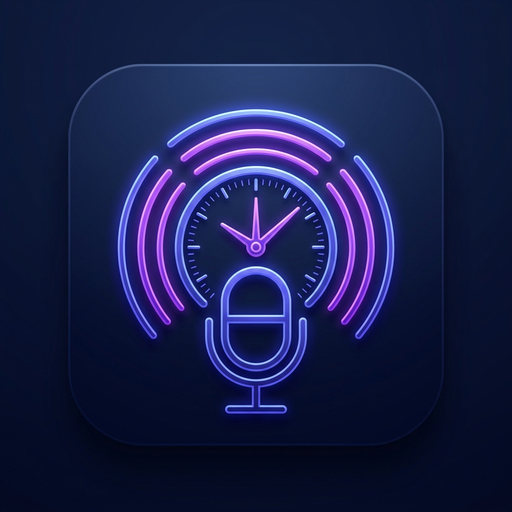
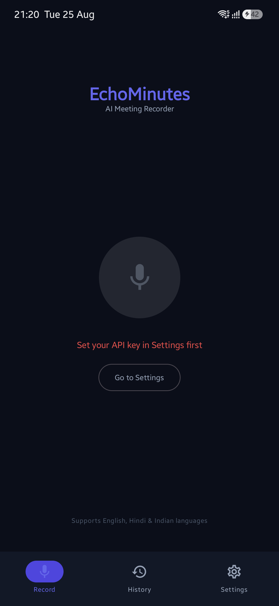
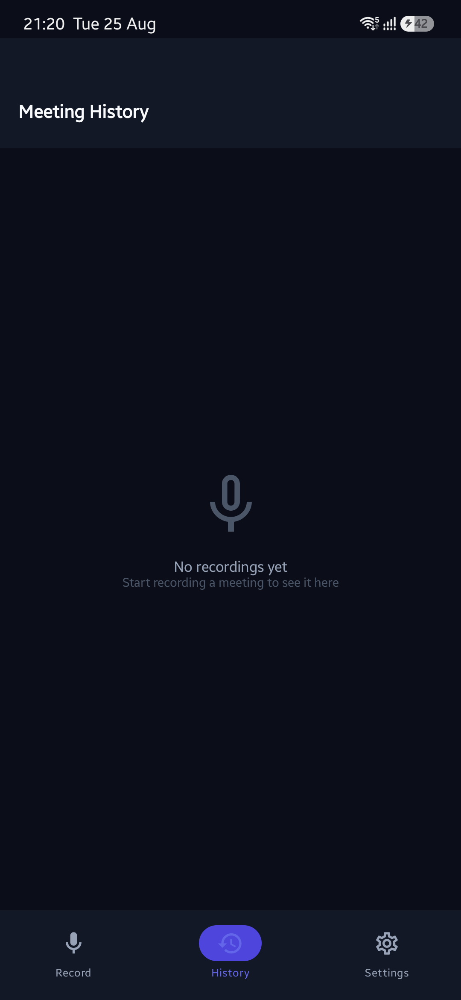
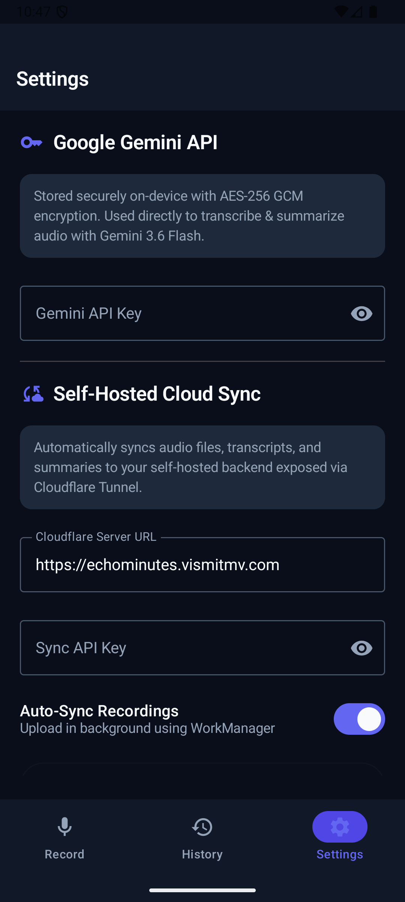

# EchoMinutes 🎙️✨

<div align="center">
  
  
  <h3>AI-Powered Meeting Recorder, Multilingual Transcriber & Self-Hosted Cloud Sync</h3>
  <p>Transcribe in-person meetings with mixed languages (English, Hindi, and Indian languages), get clean summaries with Google Gemini 3.6 Flash, and automatically sync recordings and summaries to your self-hosted backend via Cloudflare Tunnel.</p>
</div>

---

## 📱 Screenshots

<div align="center">
  <table>
    <tr>
      <td align="center"><b>Record Screen</b></td>
      <td align="center"><b>Meeting History</b></td>
      <td align="center"><b>Cloud Sync Settings</b></td>
    </tr>
    <tr>
      <td></td>
      <td></td>
      <td></td>
    </tr>
  </table>
</div>

---

## ✨ Features

- **🎙️ One-Tap Audio Recording**: Lightweight, direct recording using Android `MediaRecorder` (AAC/M4A mono, 128kbps, 44.1kHz) for optimal clarity and minimal file size.
- **⚡ Google Gemini 3.6 Flash Integration**: Direct multimodal audio processing to transcribe code-switching conversations (English, Hindi, etc.) and extract structured key takeaways, decisions, and action items.
- **☁️ Self-Hosted Cloud Sync (WorkManager)**: Automatically uploads audio recordings and summary metadata in the background to your private server with exponential backoff retries when connection is interrupted.
- **🌐 Secure Web Dashboard via Cloudflare Tunnel**: Browse meetings by date, stream audio playback, inspect markdown summaries, and view transcripts in a private web UI hosted on your domain (e.g. `echominutes.vismitmv.com`).
- **📂 Clean Storage Separation**:
  - `storage/recordings/`: Audio files saved as `YYYY-MM-DD_HH-MM-SS_MeetingTitle.m4a`
  - `storage/summaries/`: JSON metadata & `.md` markdown summaries
- **🔒 Secure On-Device Key Storage**: Stores your Gemini API key and Sync API key using Android Jetpack Security's `EncryptedSharedPreferences` with AES-256 GCM encryption.
- **📂 Local Database Storage (Room)**: Saves all meeting audio file references, full verbatim transcripts, and summaries locally for instant offline access.
- **🎨 Modern Jetpack Compose & Material 3**: Sleek, deep navy dark theme (`#0A0E17`) with electric indigo accents (`#6366F1`), smooth micro-interactions, and type-safe Navigation 3.

---

## 🖥️ Self-Hosted Backend & Cloudflare Tunnel Setup

### 1. Run the Backend Server on your Laptop
```bash
cd backend
./start.sh
```
The server will start on `http://localhost:8000`. You can configure your port, API sync key, and dashboard password in `backend/.env`.

### 2. Expose via Cloudflare Tunnel (HTTPS)
1. In the [Cloudflare Zero Trust Dashboard](https://one.dash.cloudflare.com) → **Networks** → **Tunnels**, create a tunnel named `echominutes-tunnel`.
2. Add a Public Hostname:
   - **Subdomain**: `echominutes`
   - **Domain**: `vismitmv.com`
   - **Service**: `HTTP -> localhost:8000`
3. Run the connector on your laptop:
   ```bash
   cloudflared tunnel run --token <YOUR_TUNNEL_TOKEN>
   ```
4. In the EchoMinutes mobile app under **Settings**, set:
   - **Server URL**: `https://echominutes.vismitmv.com`
   - **Sync API Key**: Your configured `SYNC_API_KEY`

---

## 🛠️ Tech Stack & Architecture

- **Android App**:
  - Kotlin + Jetpack Compose + Material 3
  - Jetpack Navigation 3 (`androidx.navigation3`)
  - Room SQLite Database (`androidx.room`)
  - WorkManager Background Sync (`androidx.work`)
  - Jetpack Security Crypto (`androidx.security.crypto`)
  - OkHttp 4 + `kotlinx.serialization`
  - Google Gemini 3.6 Flash (`gemini-3.6-flash`)
- **Backend & Dashboard**:
  - Python FastAPI + Uvicorn
  - SQLite Database (`echominutes.db`)
  - HTML5 / Vanilla CSS / JavaScript + `marked.js`
  - Cloudflare Tunnel (Zero Trust HTTPS)

---

## 🚀 Getting Started with the Android App

### Prerequisites
- Android 8.0+ (minSdk 26, targetSdk 36)
- A free Gemini API Key from [Google AI Studio](https://aistudio.google.com)

### Installation
Download the latest APK from the [Releases](https://github.com/vismitmv/EchoMinutes/releases) page or build locally:
```bash
./gradlew assembleDebug
adb install -r app/build/outputs/apk/debug/app-debug.apk
```

---

## 📄 License

This project is licensed under the Apache 2.0 License.
