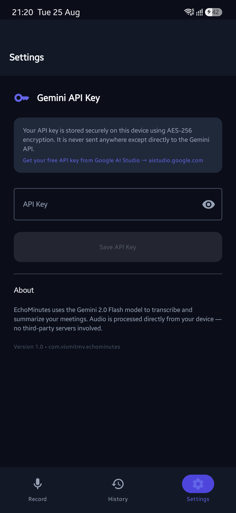

# EchoMinutes 🎙️✨

<div align="center">
  
  
  <h3>AI-Powered Meeting Recorder, Multilingual Transcriber & Summarizer</h3>
  <p>Transcribe in-person meetings with mixed languages (English, Hindi, and Indian languages) and get clean, structured summaries powered by Google Gemini 3.6 Flash.</p>
</div>

---

## 📱 Screenshots

<div align="center">
  <table>
    <tr>
      <td align="center"><b>Record Screen</b></td>
      <td align="center"><b>Meeting History</b></td>
      <td align="center"><b>Secure Settings</b></td>
    </tr>
    <tr>
      <td></td>
      <td></td>
      <td></td>
    </tr>
  </table>
</div>

---

## ✨ Features

- **🎙️ One-Tap Audio Recording**: Lightweight, direct recording using Android `MediaRecorder` (AAC/M4A mono, 128kbps, 44.1kHz) for optimal clarity and minimal file size.
- **⚡ Google Gemini 3.6 Flash Integration**: Direct multimodal audio processing to transcribe code-switching conversations (English, Hindi, etc.) and extract structured key takeaways, decisions, and action items.
- **🔒 Secure On-Device Key Storage**: Stores your Gemini API key using Android Jetpack Security's `EncryptedSharedPreferences` with AES-256 GCM encryption. No hardcoded keys or third-party servers.
- **📂 Local Database Storage (Room)**: Saves all meeting audio file references, full verbatim transcripts, and summaries locally for instant offline access.
- **🎨 Modern Jetpack Compose & Material 3**: Sleek, deep navy dark theme (`#0A0E17`) with electric indigo accents (`#6366F1`), smooth micro-interactions, and type-safe Navigation 3.
- **📋 Share & Export**: Copy summaries and transcripts to the clipboard with one tap or share directly via the native Android share sheet.

---

## 🛠️ Tech Stack & Architecture

- **Language**: Kotlin
- **UI Framework**: Jetpack Compose, Material 3
- **Navigation**: Jetpack Navigation 3 (`androidx.navigation3`)
- **Database**: Room Database (`androidx.room`)
- **Security**: Jetpack Security Crypto (`androidx.security.crypto`)
- **Networking**: OkHttp 4 + `kotlinx.serialization`
- **Audio Capture**: Android `MediaRecorder`
- **AI Model**: Google Gemini 3.6 Flash (`gemini-3.6-flash`)

---

## 🚀 Getting Started

### Prerequisites
- Android Studio Ladybug / Meerkat or later
- JDK 17+
- Android SDK 36 (minSdk 26)
- A free Gemini API Key from [Google AI Studio](https://aistudio.google.com)

### Installation
1. Clone the repository:
   ```bash
   git clone https://github.com/vismitmv/EchoMinutes.git
   cd EchoMinutes
   ```
2. Build the project:
   ```bash
   ./gradlew assembleDebug
   ```
3. Install to your connected device:
   ```bash
   adb install -r app/build/outputs/apk/debug/app-debug.apk
   ```

---

## 📄 License

This project is licensed under the Apache 2.0 License.
